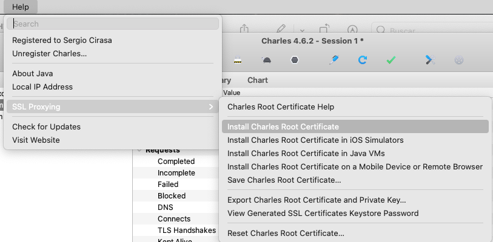
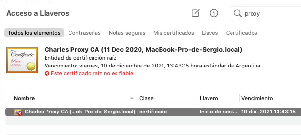
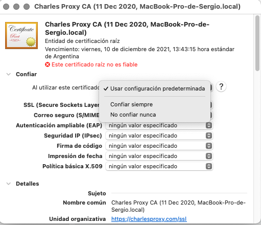
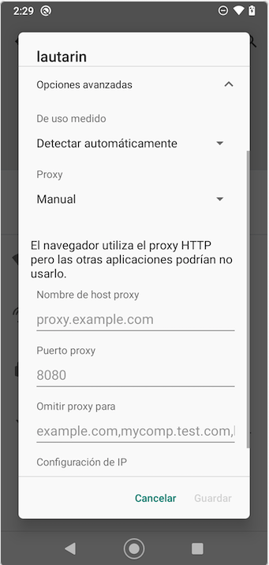

# Charles Proxy: HTTP debugging

Charles es una herramienta que permite interceptar, ver y modificar todo el tráfico HTTP / HTTPS entre la app y el servidor, pudiendo ser la app una aplicación web o mobile que corre en un dispositivo físico o emulador.

***Download:*** https://www.charlesproxy.com/


Cuando el proxy SSL esta habilitado, Charles recibe el certificado del servidor y el browser o aplicacion va a recibir el certificado de Charles. Dado que estos no van a confiar en el certificado es necesario instalar el certificado root en la computadora o dispositivo.

## Setups for Browser Debugging 

### 1. Instalar el certificado root

Abrir Charles e ir al menu:

```sh
Help --> SSL Proxying --> Install Charles Root Certificate
```



### 2. Autorizar/Confiar en el certificado

Ir al keychain y buscar el certificado instalado ***Charles Proxy CA*** 




luego darle doble click y en la seccion `Confiar` seleccionar `Confiar Siempre`



### 3. Reiniciar el Chrome y Charles

## Setups for Android Debugging 

### 1. Descargar e Instalar el certificado root en el dispositivo

Abrir el siguiente link en el dispositivo y una vez descargado abrirlo para instalarlo. Si no se descarga el certificado descargarlo desde la computadora y enviarlo de algun modo al dispositivo.

http://chls.pro/ssl

Al instalar el certificado darle un nombre `Charles` y seleccionar `VPN y aplicaciones`


### 2. Corroborar que se haya instalado

Para corroborar la correcta instalacion o borrar el certificado puede hacerse desde
```sh
Settings --> Seguridad --> Encriptación y credenciales --> Credenciales del usuario
```


### 3. Configurar la conexión entre el dispositivo y la computadora

La computadora y el dispositivo deben estar en la misma red por lo tanto o nos aseguramos que esten conectados la misma red WIFI o compartimos internet desde la computadora y nos conectamos a esta red desde el dispositivo mobile.

### 4. Configurar proxy

Obtener la IP de la computadora:

```sh
ifconfig | grep "inet " | grep -Fv 127.0.0.1 | awk '{print $2}'
```

Para configurar el Proxy se debe ir en el dispositivo a:

```sh
Settings  --> Internet y redes --> Seleccionar la red WiFi --> Settings --> Edit
```
 Dentro de opciones avanzadas en la sección proxy seleccionar manual y en `host` ingresar la IP de la computadora y en puerto `8888`



### Setups for iPhone Debugging 

### Setups for iPhone Simulator Debugging 

